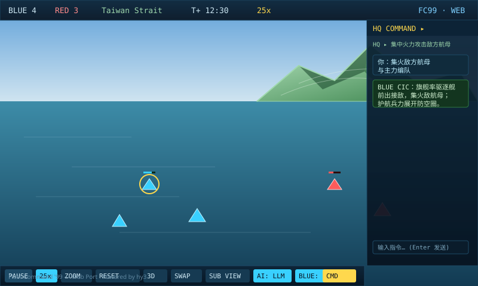
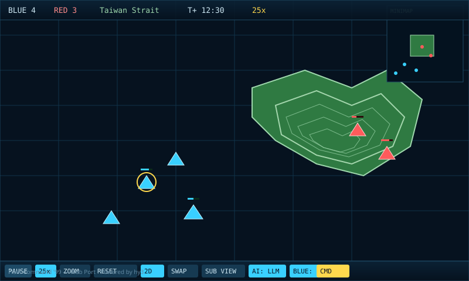
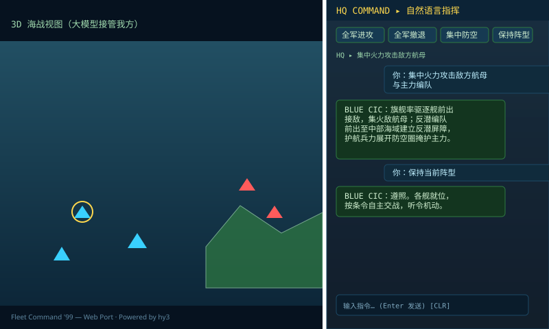

# Fleet Command '99 — Web Port

> 经典 1999 年海军指挥游戏《Fleet Command '99》的网页移植版。
> 纯前端、零构建、可离线运行，支持 3D 透视海战视图、程序化地形与
> 双边 AI 指挥官（本地大模型）。

**Powered by hy3**

[English summary below](#english-summary)

---

## 功能特性

- **真实 3D 海战视图**：基于 three.js（本地内置，离线可用），可旋转、俯仰、
  滚轮缩放贴近舰船模型；WebGL 不可用时自动降级为 2D 战术图。
- **程序化地形与等高线**：海岸线以外的地形由数字高程模型（DEM）离线生成，
  2D 战术图叠加绿色等高线，3D 视图呈现真实起伏山脉，全程沿用军事绿 CIC 配色。
- **真实卫星地图 + 真实高程（可选）**：在 URL 中附带 `?mapbox=PK...`（Mapbox
  公开令牌），即可把当前战区替换为 **Mapbox 真实卫星影像** 与 **真实地形高程**
  （terrain-rgb，等比例、无垂直夸张）。影像经重投影与海战矢量海岸线精确对齐，
  3D 山脉与 2D 底图同步更新。**不填令牌时自动回退到离线的程序化 DEM 地形**，
  令牌仅存于地址栏、绝不写入代码仓库（避免公开泄露）。
- **双 AI 指挥官**：
  - **RED（敌方）**：由本地大模型直接指挥，其思考过程对玩家隐藏（debug 可见）。
  - **BLUE（我方）**：默认由你手动指挥，可一键切换为由本地大模型指挥；
    并通过右侧 **HQ COMMAND** 对话框用中文自然语言下达总意图。
  - 决策链：你用鼠标下的硬命令 > 你的自然语言总指令 > AI 自主条令。
- **39 个原版战役任务** + 教学关 + 自定义交战编辑器。
- **原版音乐与音效**：还原 1999 年《Fleet Command》配乐。

---

## 游戏截图

> 以下为按游戏实际 CIC 配色绘制的界面示意（SVG）。

| 3D 海战视图（山脉地形） | 2D 战术图（等高线） |
| --- | --- |
|  |  |

| HQ 自然语言指挥对话框 |
| --- |
|  |

---

## 安装

### 环境要求

- **Python 3.10+**（用于启动本地静态服务器）**或** Node.js 18+
- 现代浏览器（Chrome / Edge / Firefox / Safari），需支持 WebGL 以显示 3D 视图
- （可选）[Ollama](https://ollama.com) + 模型 `qwen3.5:4b`，用于双边大模型指挥

### 1. 获取源码

```bash
git clone https://github.com/rockcitystore/fleet-command-1999-web.git
cd fleet-command-1999-web
```

### 2.（可选）配置本地大模型指挥官

如果你希望启用 RED / BLUE 的大模型指挥：

```bash
# 安装并启动 Ollama（默认监听 http://localhost:11434）
ollama pull qwen3.5:4b
```

不配置也能正常游玩——未启用大模型时，AI 会自动使用内置作战条令。

---

## 启动

本游戏是纯静态网站，必须通过本地服务器打开（ES Module 不能用 `file://` 直接运行）。

### 方式一：使用自带的 Python 服务器（推荐）

```bash
python3 serve.py
# 或指定端口： PORT=8080 python3 serve.py
```

然后浏览器打开：

```
http://localhost:8137/
```

### 方式二：使用 Node.js

```bash
npx serve .          # 或： python3 -m http.server 8137
```

打开 `http://localhost:8137/` 即可进入主菜单，选择战役 / 教学 / 自定义交战。

---

## 本地大模型指挥官

| 按钮 | 作用 |
| --- | --- |
| `AI: BUILTIN` / `AI: LLM` | 切换敌方（RED）由内置条令 / 本地大模型指挥 |
| `BLUE: HUMAN` / `BLUE: LLM` | 切换我方（BLUE）由你手动 / 本地大模型指挥 |
| `CMD` | 打开 / 收起右侧 **HQ COMMAND** 自然语言指挥对话框 |

在 HQ COMMAND 中输入中文指令（例如「集中火力攻击敌方航母」「全军向东南撤退」），
我方大模型会将其翻译为各舰具体命令；输入「取消指令 / 自由行动」或点 `CLR` 可解除。

---

## URL 参数（实验特性）

| 参数 | 作用 |
| --- | --- |
| `?mapbox=PK...` | 接入 **Mapbox 真实卫星影像 + 真实高程**（terrain-rgb，等比例无夸张）。令牌从地址栏读取，**不写入仓库**。无令牌或加载失败时自动回退离线程序化地形。 |
| `?llmdebug=1` | 在游戏内显示红 / 蓝双方大模型的实时思考流（左右分列、可点击标题折叠）。仅用于调试，关闭则控制台也保持干净。旧参数 `?debugAI=1` 仍兼容。 |

示例：

```
# 带真实卫星地图（把 PK... 换成你自己的 Mapbox 公开令牌）
http://localhost:8137/?mapbox=PK.your_token_here

# 同时打开大模型调试面板
http://localhost:8137/?mapbox=PK.your_token_here&llmdebug=1
```

> 安全提示：Mapbox 令牌建议在其账户后台设置 **URL 限制**，以防被他人盗用。

---

## 游戏手册

完整玩法、操作说明与战术建议见 👉 **[游戏手册（中文）](游戏手册.md)**。

---

## 许可协议

本项目采用自定义许可，核心条款如下（完整条款见 [LICENSE](LICENSE)）：

1. **禁止商用**：未经作者书面授权，不得用于任何商业目的（营利、付费服务、
   商业展示、流量变现等）。商业使用须事先取得书面许可。
2. **必须注明来源**：任何复制、修改、再分发、公开展示，均须显著注明
   项目名称 **Fleet Command '99 — Web Port**、作者 **hy3**、
   署名 **Powered by hy3** 与项目地址。

---

## 署名

```
Fleet Command '99 — Web Port
Powered by hy3
https://github.com/rockcitystore/fleet-command-1999-web
```

---

## English Summary

A browser port of the 1999 naval command game *Fleet Command '99* — zero-build,
fully offline, with a real 3D WebGL battle view (three.js, vendored), procedural
terrain relief + contour lines, and dual on-device LLM commanders (local Ollama,
`qwen3.5:4b`). Two AI sides: RED (enemy, hidden reasoning) and BLUE (player,
controllable via a natural-language HQ command chat).

- **Run:** `python3 serve.py` then open `http://localhost:8137/` (any static server works).
- **Optional LLM:** `ollama pull qwen3.5:4b` to enable the AI commanders.
- **Optional real satellite + elevation:** append `?mapbox=PK...` (your own Mapbox
  public token, read from the URL only — never committed) to swap the procedural DEM
  for real Mapbox satellite imagery and true-scale terrain-rgb elevation. Offline
  (no token) falls back to the procedural terrain automatically.
- **Debug URL params:** `?llmdebug=1` shows the live RED/BLUE LLM reasoning panels
  in-game (collapsible, side-by-side); `?debugAI=1` is a legacy alias.
- **License:** non-commercial use only; you must attribute the source
  (project name, author **hy3**, "Powered by hy3", and the repo URL). See [LICENSE](LICENSE).

**Powered by hy3**
